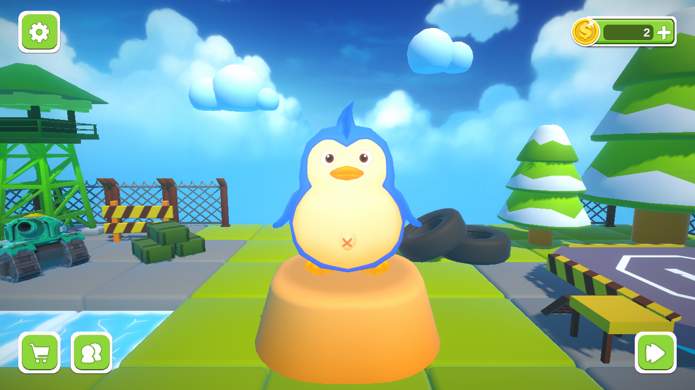
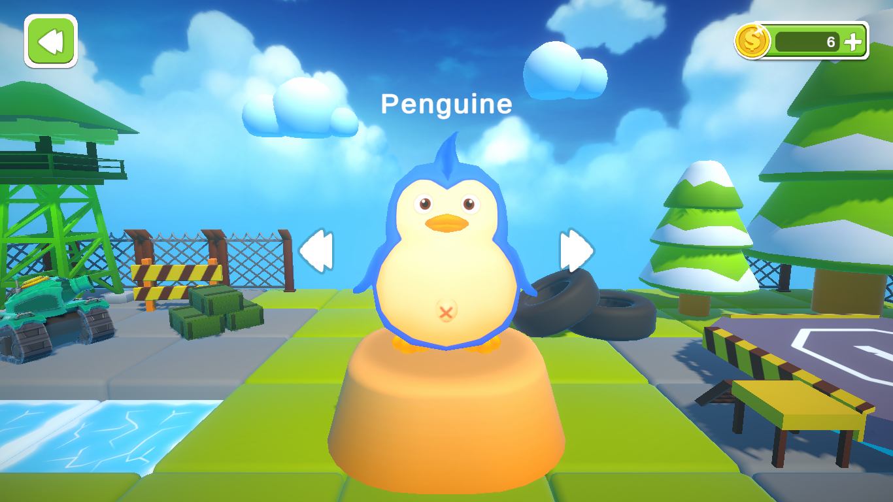
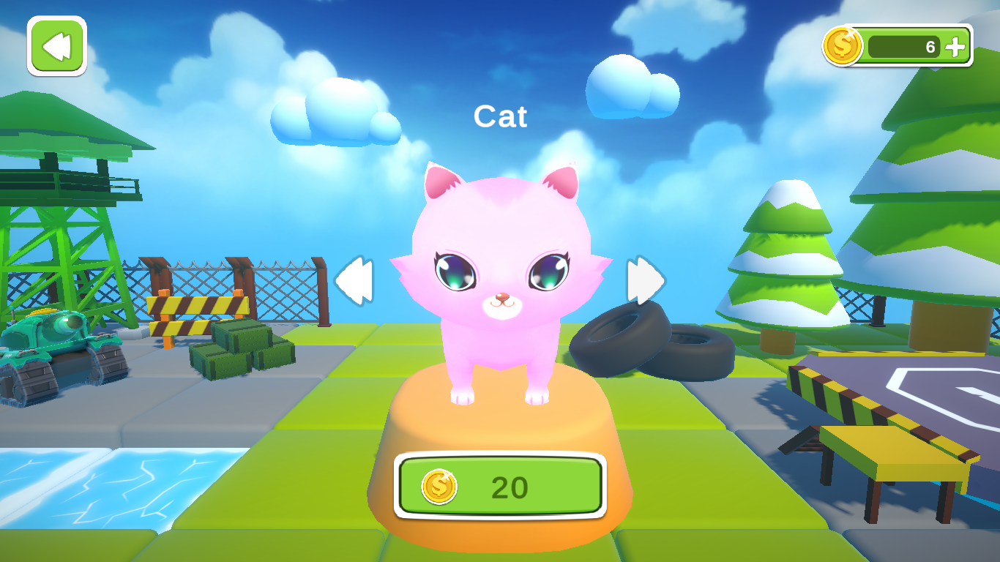
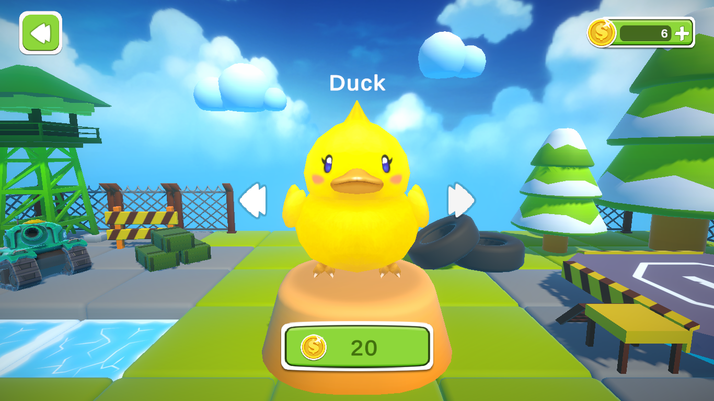
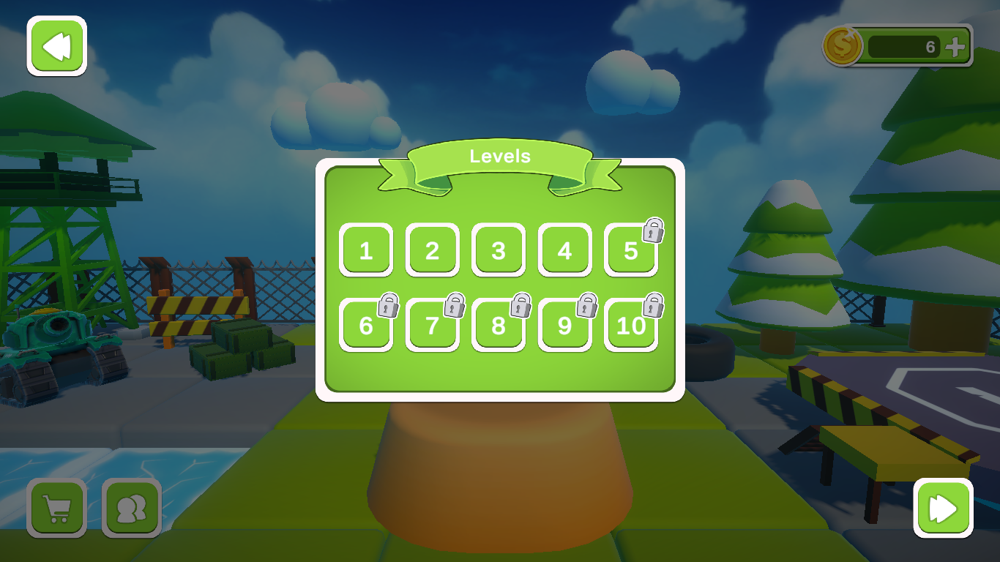
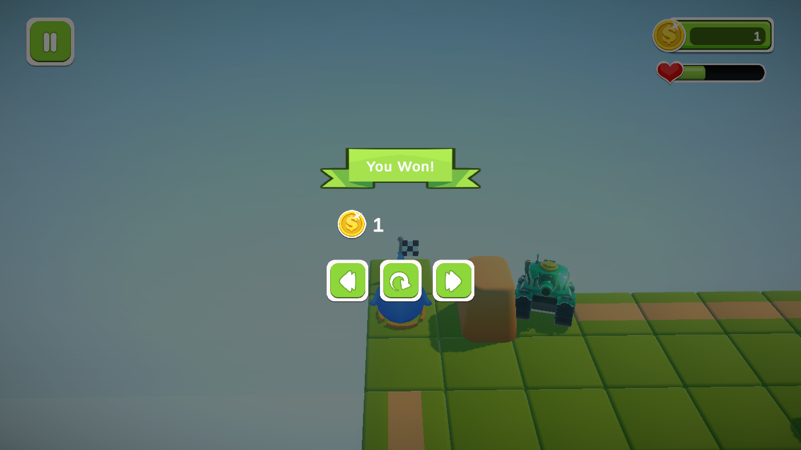

# 🎮 Boomy Run

  
  
  

**Boomy Run** is an addictive, casual coin-collecting runner designed by **Soft Game Studio**. Built for a "mind-relaxing" experience, players navigate vibrant levels, dodge dangerous tanks, and hunt for gold. 

[🚀 Download Now](https://github.com/) • [🐞 Report Bug](https://github.com/) • [💡 Suggest Feature](mailto:team.softgamestudio@gmail.com)

---

## 🕹 Game Modes

### 🪙 Coin Quest (Available Now)
The classic objective-based mode. Navigate the terrain, avoid heavy artillery (tanks), and reach the finish line with your pockets full of gold.

### ♾️ Endless Runner (Coming Soon)
Test your endurance! The speed increases, the obstacles multiply, and the only goal is the highest score possible.

### 🌐 Multiplayer Challenge (In Development)
Compete in real-time. Face off against other players to see who can clear the map and claim the most coins first.

---

## 🚀 Technical Overview

| Feature | Details |
| :--- | :--- |
| **👨‍💻 Developer** | Soft Game Studio |
| **⚙️ Engine** | Unity 3D |
| **📦 Size** | ~155 MB |
| **🎮 Controls** | Keyboard / Controller Support |
| **💰 Model** | 100% Free to Play |

---

## ✨ Key Features

* **🧘 Relaxing Gameplay:** Low-stress mechanics designed for quick gaming breaks.
* **🚫 Zero Friction:** No login, no registration, and no internet required for single-player.
* **🛡️ Safe & Lightweight:** Optimized for Windows 10/11 with a small disk footprint.
* **🎨 Vibrant Visuals:** Funny character designs and colorful environments.

---

## 📸 Screenshots

|  |  |  |
| :---: | :---: | :---: |
| **Level Start** | **Character Selection** | **Cat Character** |

|  |  |  |
| :---: | :---: | :---: |
| **Ducky Character** | **Levels** | **Victory Screen** |

---

## 📦 Installation (Windows)

1. Go to the **[Releases](https://github.com/)** page.
2. Download the latest `BoomyRun_Installer.exe`.
3. Run the installer and follow the on-screen prompts.
4. Launch the game from your desktop shortcut! 🎉

> [!TIP]
> **System Requirements:** Windows 10/11 (64-bit), 4GB RAM, and a basic dedicated or integrated GPU.

---

## 📱 Mobile Version
* **Android:** ⏳ Under development. Check back soon for the APK!

---

## 📄 License & Contact

* **License:** Distributed under a **Custom EULA**. See `license.txt` for details.
* **Email:** [team.softgamestudio@gmail.com](mailto:team.softgamestudio@gmail.com)

---

  <b>If you enjoy Boomy Run, please give us a ⭐ Star!</b> 
  <i>Developed with passion by Soft Game Studio</i>

